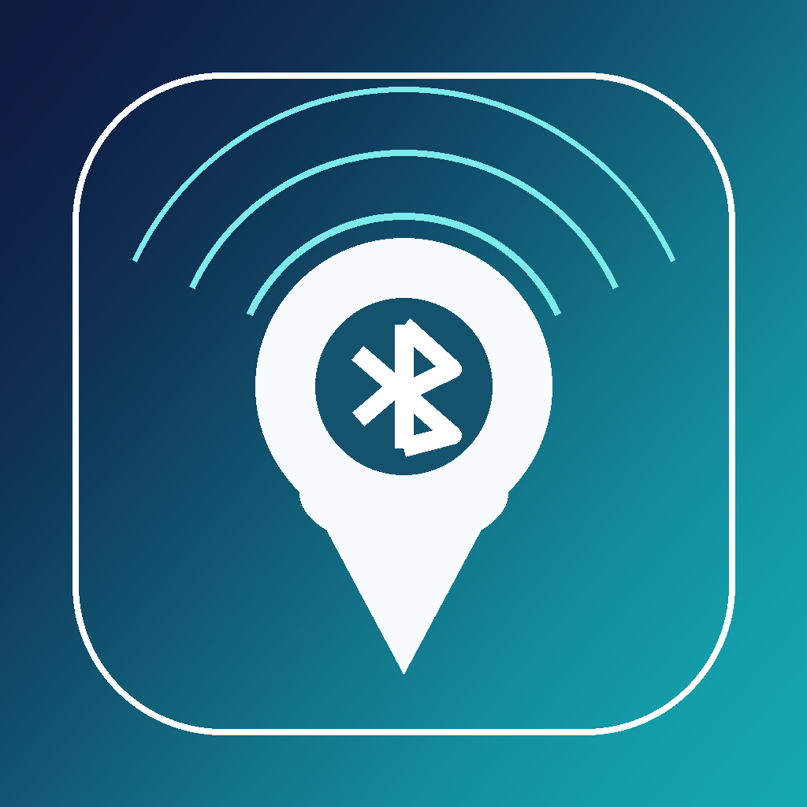

# SignalTrail

SignalTrail is a universal iOS/iPadOS 15.2 Bluetooth Low Energy scanner and observation logger built with UIKit, CoreBluetooth, Core Location, MapKit, and UserNotifications.



## Build requirements

- **Xcode 14.0 or newer**
- iOS/iPadOS deployment target: **15.2**
- A physical iPhone or iPad for BLE scanning
- An Apple development team selected under **Signing & Capabilities**

The `.xcodeproj` uses the Xcode 12 project-file compatibility format, but Xcode 12 cannot build an iOS 15.2 target because it does not include the iOS 15.2 SDK. Xcode 14 was the first release to include that SDK.

## Run

1. Open `SignalTrail.xcodeproj`.
2. Select the **SignalTrail** target.
3. Change the bundle identifier if required.
4. Select your Apple development team.
5. Run on a physical iPhone or iPad.
6. Grant Bluetooth access. Grant location access when starting a recorded session.

The iOS Simulator does not provide normal nearby BLE scanning, so use real hardware.

## Current features

- Timed active BLE scan, defaulting to two minutes
- User-started recorded sessions using configurable scan bursts and pauses
- Repeated advertisement logging with timestamp, RSSI, advertisement fields, and the phone's current location
- Live filtering with search, minimum-RSSI thresholds, and signal-strength indicators
- Device details, connection, service discovery, characteristic read/write, and notifications
- Bluetooth SIG company-name lookup from bundled `company_identifiers.yaml`
- Bluetooth SIG 16-bit member UUID detection and display for advertised service UUIDs
- Known-device nicknames, notes, and saved matching metadata
- Local alerts matching:
  - iOS peripheral identifier
  - Bluetooth SIG company identifier
  - Bluetooth SIG company name
  - advertised name substring
  - manufacturer-data prefix
  - advertised service UUID
  - derived Bluetooth member UUID name
- Saved-alert on/off toggles directly in the alert list
- A seeded default alert for Axon/TASER identifiers and names
- Session list, map, clustered observation markers, phone observation route, timeline scrubbing, and playback
- JSON and CSV session export
- Local-only persistence
- Unit tests for alert matching and session persistence

## Important platform limits

- CoreBluetooth does **not** expose a BLE hardware MAC address on iOS. SignalTrail uses the app-scoped `CBPeripheral.identifier` and advertisement content instead.
- A map marker is the **phone location where an advertisement was observed**. It is not the BLE device's verified location.
- “Record” mode is application-level burst scanning. It is not raw RF sniffing, and iOS controls the underlying radio scan intervals.
- The MVP deliberately stops scanning when the app enters the background. This avoids implying reliable continuous monitoring that iOS does not guarantee for an unrestricted device scan.
- Company identifier and company-name alerts only work when the peripheral includes manufacturer data with a Bluetooth SIG company identifier.

## Data storage

Application Support contains:

```text
SignalTrail/
├── alert-rules.json
├── known-devices.json
└── sessions/
    ├── <session-id>.session.json
    └── <session-id>.detections.jsonl
```

Each observation is appended as one JSON object per line. This avoids rewriting a potentially large JSON array for every advertisement and keeps migration to GRDB/SQLite straightforward.

Settings are stored separately in `UserDefaults` under the app's `SignalTrail.AppSettings` key.

## Privacy and App Store work

Before distribution:

- Write a user-facing privacy policy.
- Complete App Store privacy labels accurately for precise location and device/diagnostic data actually collected.
- Review retention controls and add an explicit “delete all data” option if required.
- Add a privacy manifest when building with a toolchain/App Store policy that requires one for the APIs or third-party SDKs used.
- Do not market the app as locating devices or exposing MAC addresses.

## App structure

The app presents four tabs:

- `Scan`: live scan results, active/record modes, and device search
- `Sessions`: recorded-session replay, map playback, and export
- `Known`: saved devices and detection-alert management
- `Settings`: scan timing, filters, permissions, and reset actions

## Project layout

See [`ARCHITECTURE.md`](ARCHITECTURE.md) for responsibilities, data flow, extension points, and known MVP trade-offs.

## Contributing

Keep changes narrowly scoped and commit with short imperative subjects, for example `Add session export validation`. Run `xcodebuild -project SignalTrail.xcodeproj -scheme SignalTrail -destination 'platform=iOS Simulator,name=<installed simulator>' test` when changing testable logic, and note any required on-device BLE verification in your pull request.
