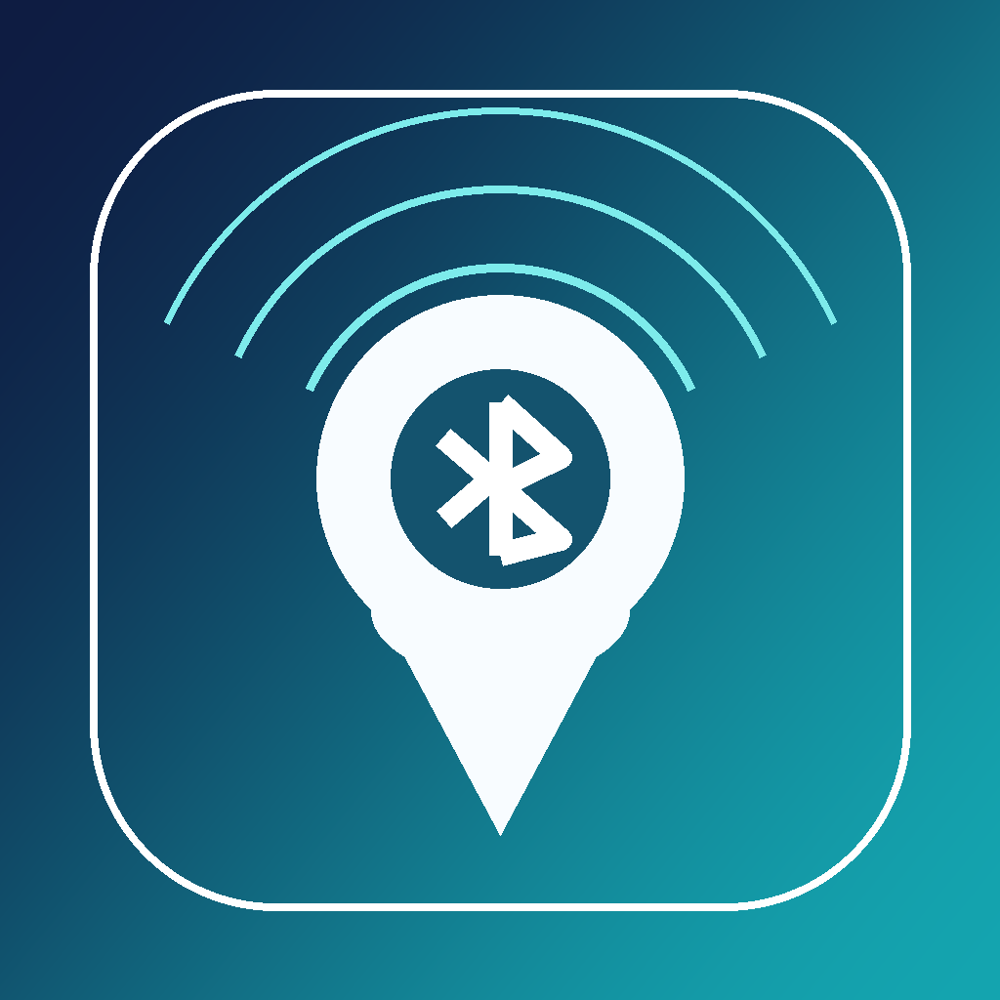

# SignalTrail

SignalTrail is a Bluetooth Low Energy scanner and observation logger for iPhone and iPad. It supports iOS and iPadOS 15.0 or later and is written in Swift, built with UIKit, CoreBluetooth, Core Location, MapKit, and UserNotifications.

SignalTrail is pre-configured to identify and alert the user to the presence of:
- Police & Military issued body worn camera's and handheld Taser Weapons manufactured by Axon Inc / Taser International
- Meta/Rayban smart glasses
- Apple's 'Find My' compatible tracking devices
- Credit Card skimmers used to steal payment-card details from payment terminals or ATMS (generic chinese models)
- Flock Safety surviellance cameras that are misconfigured or have not been upgraded (This uses the battery infomation vulnerabilty which has largelt been patched as of August 2026) 





The app was written to investigate passive surviellence technique's, the concept of digital fingerprinting and identification, and to explore the hidden environment that connects our "smart" cities, homes, and workplaces.

## Build requirements

- Xcode 14.0 or later
- iOS or iPadOS 15.0 deployment target
- A physical iPhone or iPad for BLE scanning
- An Apple development team selected under `Signing & Capabilities`

## Run

1. Open `SignalTrail.xcodeproj`.
2. Select the **SignalTrail** target.
3. Change the bundle identifier if needed.
4. Select your development team under `Signing & Capabilities`.
5. Run on a physical iPhone or iPad.
6. Review the first-run introduction.
7. Grant Bluetooth access when scanning. Grant location access when starting a recorded session.

The iOS Simulator cannot perform normal nearby BLE scans. Use a physical device for scanning; the Simulator is still suitable for unit tests.

## Features

### Scanning and sessions

- First-run guidance for Quick Scan, Record Session, and location data
- A readiness checklist for Bluetooth, Location, and Notifications
- Timed Quick Scans, set to two minutes by default
- Recorded sessions with configurable scanning and pause intervals
- Repeated advertisement logging, including the timestamp, RSSI, advertisement fields, and the phone's location
- Live search, filters, sorting, minimum RSSI thresholds, and signal-strength indicators
- Session maps with clustered observation markers, the phone's route, timeline scrubbing, and playback
- Session export in JSON or CSV format

### Devices and Bluetooth data

- Scan results that show useful details, such as the device name, inferred company or profile, signal age, observation count, and status, before raw identifiers
- Device summaries with expandable technical sections and tap-to-copy raw values
- Device connections, service discovery, characteristic reads and writes, and notifications
- Bluetooth SIG company-name lookup using the bundled `company_identifiers.yaml`
- Context-aware names for Bluetooth SIG services, characteristics, descriptors, units, member UUIDs, and standards-organization UUIDs
- Read-only enrichment after connection using GAP Appearance and Device Information values, including structured PnP ID decoding
- Decoding for selected Bluetooth SIG characteristics, including identity strings, Battery Level, Heart Rate, HID metadata, cycling, running, Fitness Machine, and environmental data. Raw bytes remain available.
- GATT navigation that clearly separates observed advertisements, values reported by the device, and inferred categories

### Library and alerts

- Saved devices with nicknames, notes, and matching metadata
- Alerts that can match an iOS peripheral identifier, Bluetooth SIG company identifier or name, advertised-name substring, manufacturer-data prefix, advertised service UUID, or derived Bluetooth member UUID name
- Alert enable and disable controls, status counts, recent matches, plain-language previews, and a test action before saving
- Alert templates available from live scan results, device details, recorded sessions, and saved devices
- Default alerts for Axon/TASER identifiers and names, Apple Find My Offline Finding-like broadcasts, Flipper Zero service UUIDs, Flock/Penguin battery-like broadcasts, HC-03/HC-05/HC-06 serial-module names, and Meta/Ray-Ban identifiers

All data stays on the device. Unit tests cover alert matching and session persistence.

## Important platform limits

- CoreBluetooth does not expose a BLE hardware MAC address on iOS. SignalTrail uses the app-scoped `CBPeripheral.identifier` and advertisement data instead.
- Each map marker shows where the phone observed an advertisement. It does not show the BLE device's verified location.
- Record Session uses application-level scan bursts. It is not raw RF sniffing, and iOS controls the radio's scan intervals.
- The MVP deliberately stops scanning when the app enters the background. This avoids implying reliable continuous monitoring that iOS does not guarantee for an unrestricted device scan.
- Company identifier and company-name alerts only work when the peripheral includes manufacturer data with a Bluetooth SIG company identifier.
- Company identifiers, member UUIDs, names, Appearance values, and GATT identity values come from the device or an assigned namespace. They do not prove who made the device or identify its exact product model.
- Post-connection enrichment begins only after the user taps Connect. SignalTrail reads a limited set of standard, readable identification characteristics. This process never writes to characteristics or enables notifications.
- GATT writes can alter device behavior, so characteristic writes are grouped under Advanced tools and require confirmation.

## Data storage

Application Support contains:

```text
SignalTrail/
├── alert-rules.json
├── known-devices.json
└── sessions/
    ├── <session-id>.session.json
    └── <session-id>.detections.jsonl
```

SignalTrail appends each observation as one JSON object per line. This avoids rewriting a large JSON array whenever it receives an advertisement and leaves a clear migration path to GRDB or SQLite.

Settings are stored separately in `UserDefaults` under the app's `SignalTrail.AppSettings` key.

## App structure

The app presents four tabs:

- `Scan` provides Quick Scan, Record Session, permission checks, filters, sorting, minimum RSSI controls, and device search.
- `Sessions` provides recorded-session replay, map playback, and export.
- `Library` contains saved devices and detection alerts.
- `Settings` contains scan timing, permissions, and reset actions.

## Project layout

See [`ARCHITECTURE.md`](ARCHITECTURE.md) for responsibilities, data flow, extension points, and known MVP trade-offs.

## Contributing

Keep changes narrowly scoped. Use short, imperative commit subjects such as `Add session export validation`.

When changing testable logic, run:

```sh
xcodebuild -project SignalTrail.xcodeproj -scheme SignalTrail -destination 'platform=iOS Simulator,name=<installed simulator>' test
```

Note any required on-device BLE verification in the pull request.
